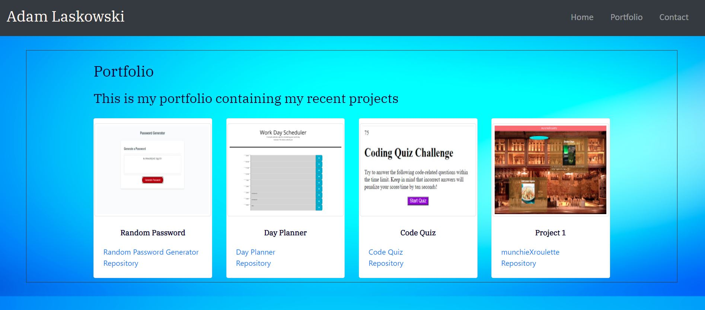
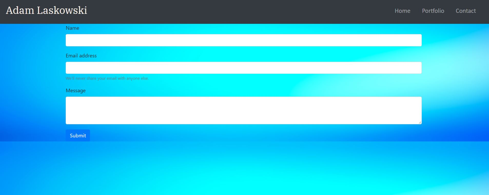

# Unit 08 Project 1 Homework: Professional Materials
## Adam Laskowski

https://adamlaskowski1.github.io/Updated-Portfolio-Page/

## Contents

Navigation bar to the following pages
* Home
* Portfolio
* Contact

## Home Page

### About Me

The about me section contains a frief bio about myself. This includes:
* Location
* Relevant work experience
* Education
* Certifications

After the Bio there are four links including:

* LinkedIn profile
* Facebook profile
* GitHub profile
* Resume PDF 

Contact Information
* Email
* Phone number

## Portfolio

This page contains a portfolio of my recent projects including:
* Random Password Generator
1. Link to Random Password Generator site
2. Link to Random Password Generator repository
* Work Day Scheduler
1. Link to Work Day Scheduler site
2. Link to Work Day Scheduler repository
* Code Quiz
1. Link to Code Quiz site
2. Link to Code Quiz repository
* Project 1
1. Link to Project 1 site
2. Link to Project 1 repository

## Contact

This page contains text boxes for user input

* Name
* Email Address
* Message
* Submit Box

